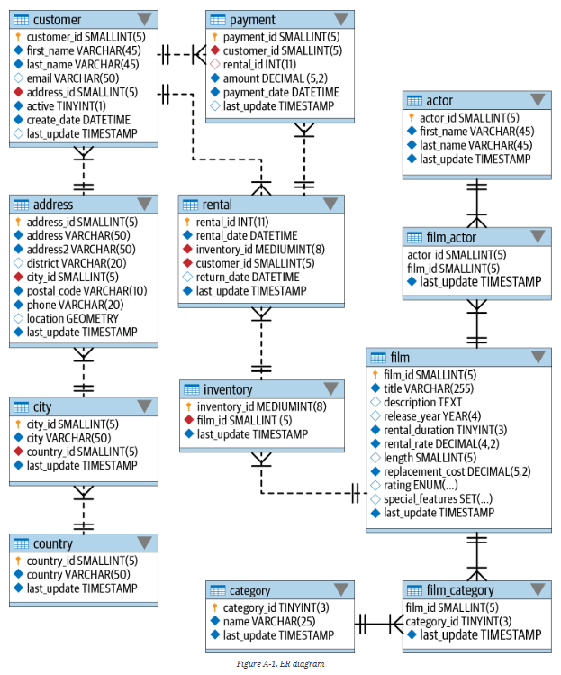

# APPENDIX A - ER DIAGRAM FOR EXAMPLE DATABASE

- An Entity Relationship (ER) diagram depicts the entities (tables) in the database along with the foreign-key relationships between the tables
	- Each rectangle represents a table, with the table name above the upper-left corner of the rectangle. The primary-key column(s) are listed first, followed by nonkey columns
	- Lines between tablees represent foreign key relationships. The markings at either end of the lines represent the allowable quantity, which can be zero (0), one (1), or many (`<`). For example, if you look at the relationship between the `customer` and `rental` tables, you would say that a rental is associated with exactly one customer, but a customer may have zero, one or many rentals

